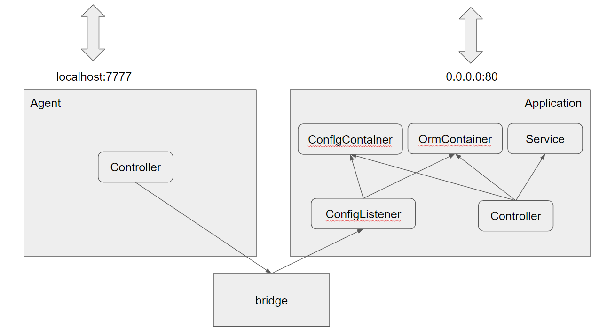

## 클래스 간 의존 관계



Application의 Controller는 각종 Service 클래스, ConfigContainer,
OrmContainer(DatabaseConnectionContainer)에 의존하며 요청이 들어왔을 때 필요한
Container 객체로부터 설정값 또는 orm 객체를 받아와 사용합니다.

ConfigListener 클래스는 ConfigContainer, OrmContainer에 의존하며 외부에서 요청 시
두 Container 객체를 업데이트하는 역할을 맡습니다.

Agent는 외부에서 새로운 설정값을 받습니다. 사용하는 포트는 보안을 위해 사용자 요청을
받는 포트와 분리했습니다. Localhost에 listen한 뒤 SSH로 연결하는 식으로 보안을 높일
수 있다고 생각했습니다.

bridge는 전역 객체로 Agent와 Application의 ConfigListener를 연결해줍니다.

## 타입 정의

설정값의 유효성을 검증하기 위한 스키마와 ORM의 모델 정의에서 타입 시스템을 잘 활용하고자 했습니다. Config 클래스에는 있는 프로퍼티가 joi 스키마에는 빠진다거나 타입이 서로 다르게 설정되는 실수를 방지하기 위해 고민했고 이를 위해 다음과 같이 코드를 짰습니다.

```typescript
// ./Server/src/configSchema.ts
import { makeSchema } from "./utility/joi";

export class Config {
  databaseReplication: DatabaseReplicationConfig =
    new DatabaseReplicationConfig();
  databaseRetryMax = 0;
  databasePoolMax = 0;
  jwtSecret = "";
}

//makeSchema를 통해 만든 스키마는
//Config과 같은 이름의 프로퍼티들을 가집니다.
export const configSchema = makeSchema<Config>({
  databaseReplication: databaseReplicationConfigSchema,
  databaseRetryMax: joi.number().required(),
  databasePoolMax: joi.number().required(),
  jwtSecret: joi.string().required(),
});

// ./Server/src/model.ts
interface CategoryAttribute {
  id?: number | null;
  label?: string | null;
  postList?: Post[] | null;
}

//implements CategoryAttribute를 통해
//CategoryAttribute의 프로퍼티가 누락되는 일이 없습니다.
@Table({
  timestamps: false,
  omitNull: true,
})
export class Category
  extends Model<CategoryAttribute>
  implements CategoryAttribute
{
  //CategoryAttribute의 프로퍼티와 똑같은 타입으로 정의됩니다.
  @Unique
  @Column(DataType.STRING(10))
  label: CategoryAttribute["label"];

  @HasMany(() => Post)
  postList: CategoryAttribute["postList"];
}
```
