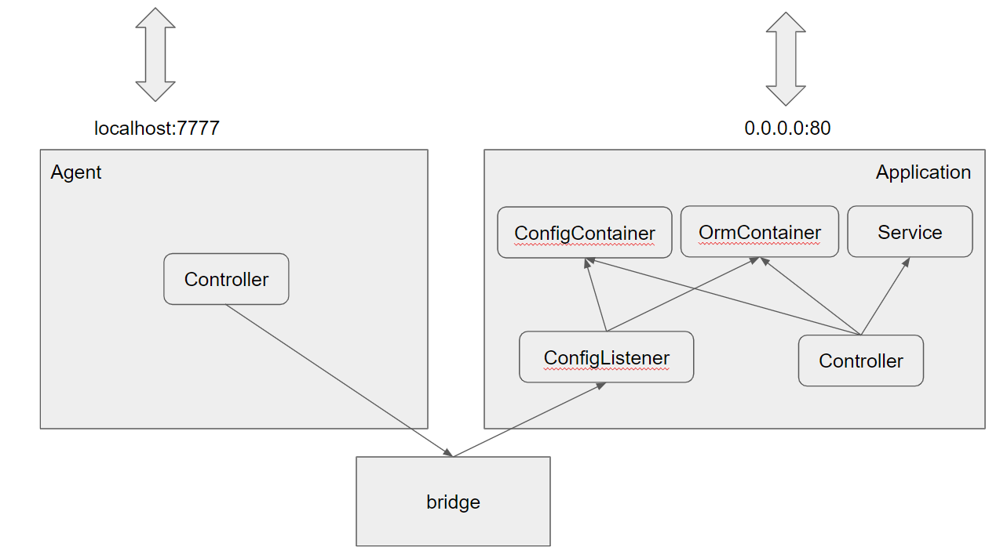

## 클래스 간 의존 관계

Application의 Controller는 각종 Service 클래스, ConfigContainer, 
OrmContainer(DatabaseConnectionContainer)에 의존하며 요청이 들어왔을 때 필요한
Container 객체로부터 설정값 또는 orm 객체를 받아와 사용합니다.

ConfigListener 클래스는 ConfigContainer, OrmContainer에 의존하며 외부에서 요청 시
두 Container 객체를 업데이트하는 역할을 맡습니다.

Agent는 외부에서 새로운 설정값을 받습니다. 사용하는 포트는 보안을 위해 사용자 요청을 
받는 포트와 분리했습니다.

bridge는 전역 객체로 Agent와 Application의 ConfigListener를 연결해줍니다.
